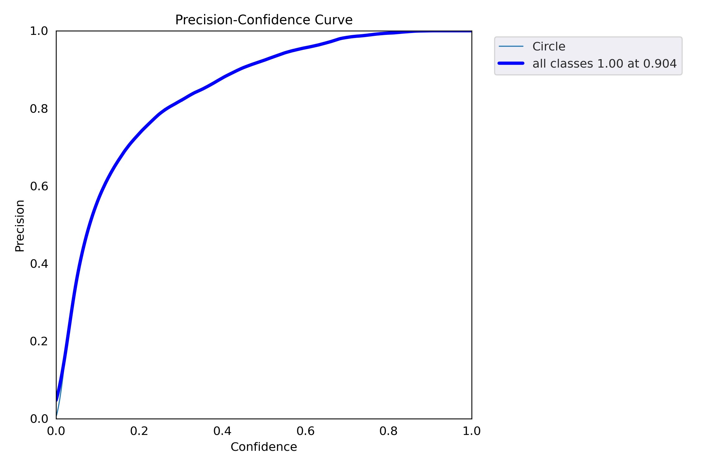
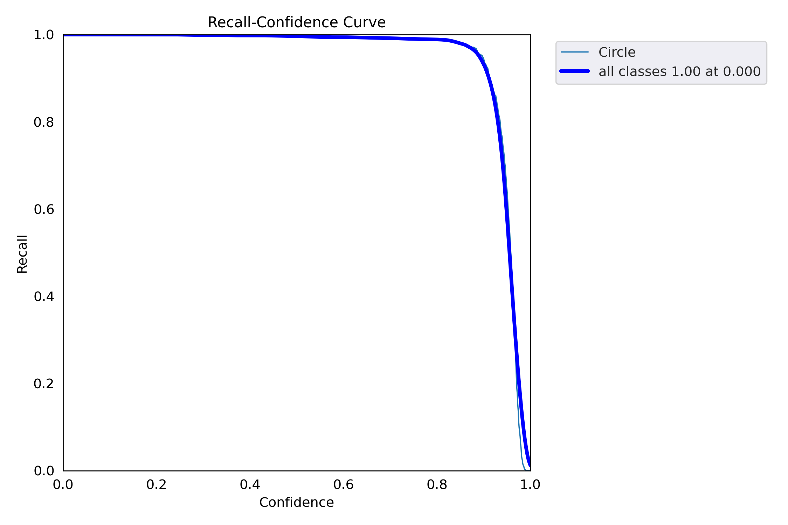
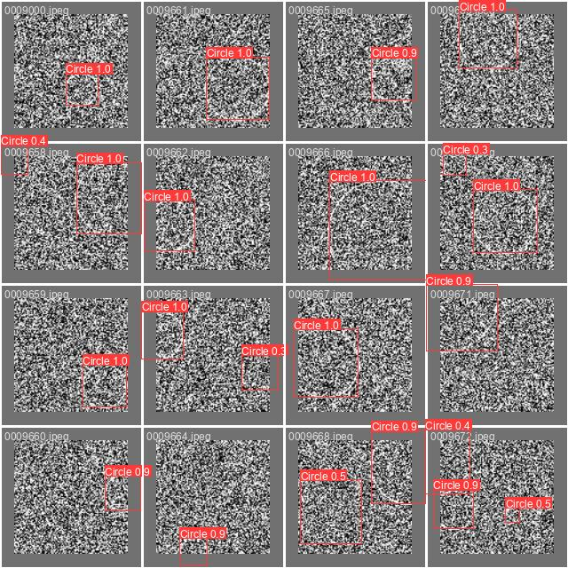

# Circle-Detection-ML-Challenge

### Model

YOLOv5 is used to as a detection model for this project. To get the YOLOv5 model 

    git clone https://github.com/ultralytics/yolov5.git

Yolov5s model is used for training which has 7.2M paramaters. Other models can also be trained 

### Dataset

To train the YOLOv5 first dataset with 10 thousand images and labels 
created. 

[0.8, 0.1, 0.1] datasplit rate is used for train, validation and testing. 

    python generate_data.py

### Train

The model is trained on Google Colab. To run the model run the "train100s.ipynb" file step by step.

### Results

The detailed results can be found in results folder. Here is the overall results

|      metrics/mAP_0.5 | metrics/mAP_0.5:0.95 |
|----------------------|----------------------|
| 0.99468              | 0.96255              |

